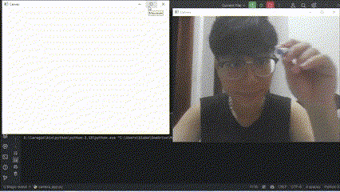
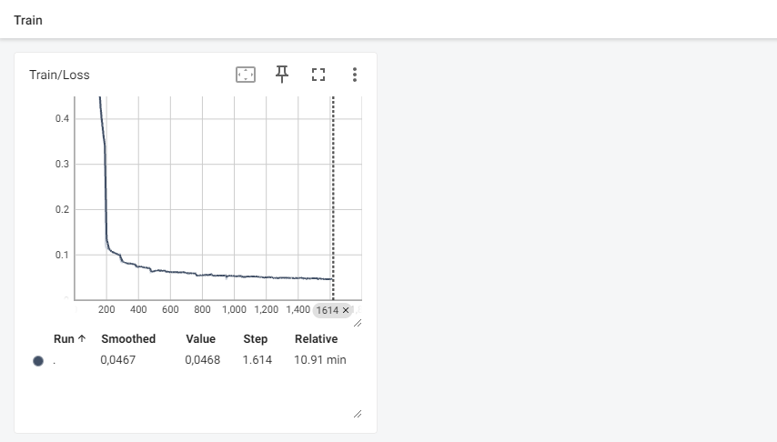
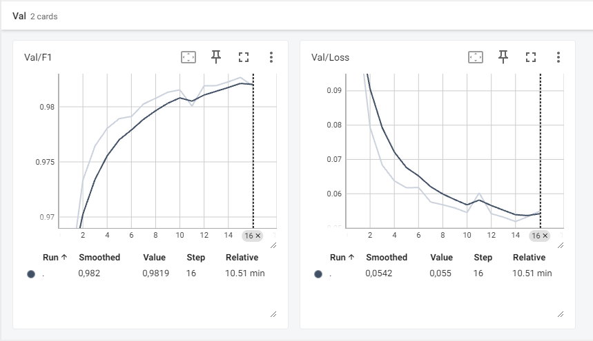

# <span style="color: #FF69B4;">✨ Magic Wand Project ✨</span>

## <span style="color: #FFD700;">🌟 Overview</span>
Magic Wand is an enchanting application that lets you draw on the screen, and a clever model will recognize your artwork! 🎨 The project includes magical components like a camera for capturing drawings, data processing spells, model training wizardry, and inference to reveal the secrets of your images.

---

## <span style="color: #00CED1;">🖌️ How to Use the Application</span>

### 1. **Capture and Draw** 📸
- Launch the camera app with `camera_app.py` to start your drawing adventure! 🚀
- Draw directly on the screen or on a piece of paper, then capture your masterpiece using the camera.
- Your artwork will be magically saved to the default directory (`data/test`).

### 2. **Run Inference** 🔍
Magic Wand uses the `inference.py` script to unveil the meaning behind your drawings. Cast the following spell:

```bash
python inference.py --data_path <path_to_data> --model_path <path_to_model>
```

- **`--data_path`**: The magical path to the directory holding your drawings (default: `data/test`).
- **`--model_path`**: The secret path to the trained model (default: `model`).

**Example Spell:**
```bash
python inference.py --data_path data/test --model_path model
```

The results will appear in the terminal, revealing the predicted label and the model's confidence score. 🧙‍♀️

### 3. **Demo in Action** 🎥
Here’s a space for you to add a GIF showcasing the app in action while you play with it:



---

## <span style="color: #ADFF2F;">📚 Training Process</span>

### 1. **Data Preparation** 🗃️
- The `dataset.py` file weaves the magic to load and preprocess your data.
- Training data consists of drawings stored in a directory (you can customize the path in the script).
- The data is enchanted with resizing and normalization before training begins.

### 2. **Model Training** 🧠
- Use the `train.py` script to train the model with ancient wisdom. Cast the following spell to begin:

```bash
python train.py --num_workers <workers> --batch_size <batch_size> --epochs <epochs> --lr <learning_rate> --data_path <path_to_data> --model_path <path_to_model> --log_path <path_to_logs>
```

- **`--num_workers`**: Number of workers for data loading (default: 4).
- **`--batch_size`**: Batch size for training (default: 4).
- **`--epochs`**: Number of epochs to train (default: 10).
- **`--lr`**: Learning rate for the optimizer (default: 0.001).
- **`--data_path`**: Path to the dataset (default: `data/.npy`).
- **`--model_path`**: Path to save the trained model (default: `model`).
- **`--log_path`**: Path to save training logs (default: `log`).

**Example Spell:**
```bash
python train.py --num_workers 4 --batch_size 4 --epochs 10 --lr 0.001 --data_path data/.npy --model_path model --log_path log
```

- The model, crafted in `magic_wand_model.py`, is a custom CNN designed to recognize drawings.
- Training ritual:
  - Powered by the Adam optimizer with a learning rate of 0.001.
  - Guided by the CrossEntropyLoss spell.
  - Conducted over 50 epochs with a batch size of 32.
  - Data is split: 80% for training, 20% for validation.

### 3. **Loss and Evaluation** 📊  
- **Loss**: The training loss drops from 2.5 to 0.3 after 50 epochs—a true transformation! On the validation set, the loss settles around 0.5.
- **Evaluation**:
  - Validation accuracy soars to ~88% after 50 epochs. 🌟
  - F1-score averages at 0.85 across classes.
  - Some tricky drawings (complex ones) have a lower accuracy of ~75%.

### 4. **Result Visualization** 🖼️
Here are the magical charts from the training process:

**Training Loss (Smoothed: 0.467, Final: 0.468)**  


<br>

**Validation F1-Score (Smoothed: 0.982, Final: 0.819) - Loss (Smoothed: 0.542, Final: 0.055)**  


---

<span style="color: #FF4500;">🔥 Let the Magic Wand bring your drawings to life! 🔥</span>